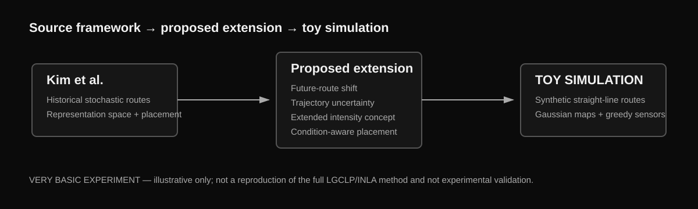

# Prediction- and Uncertainty-Aware Sensor Placement for Stochastic Trajectories

> ## **TOY SIMULATION / VERY BASIC EXPERIMENT**
> This repository documents a deliberately simplified exploratory simulation using **synthetic trajectories**. It is **not** a reproduction of the source paper’s full LGCLP/INLA framework, **not** an experimental validation, and **not** presented as a research-grade deployment model. The purpose was to test a proposed extension idea and visualize how changing trajectory assumptions can change greedy sensor placement.



A proposed research extension built from the barrier-coverage framework of Kim, Stilwell, Yetkin, and Jimenez, **“Near-optimal Sensor Placement for Detecting Stochastic Target Trajectories in Barrier Coverage Systems”** (arXiv:2505.00825), followed by a **toy MATLAB simulation** of that extension.

> **Timeline note**  
> The research task and simulation in this repository were carried out in **May–June 2026** and submitted to Prof. Mingyu Kim on **June 5, 2026**. This GitHub repository was organized and published later in **September 2026**. The repository publication date should therefore not be interpreted as the date the underlying work was performed.

## What is source work, and what is my extension?

### 1. Starting point — Kim et al.

The source paper formulates near-optimal sensor placement for linear stochastic target trajectories in a 2-D barrier coverage system. Its core workflow includes:

1. approximating local target trajectories as straight lines,
2. mapping each line into representation space using
   \(\alpha = \pi/2 + \arctan(m)\) and \(p=b/\sqrt{1+m^2}\),
3. estimating stochastic trajectory intensity using an LGCLP formulation and INLA,
4. mapping sensor detection performance into the same representation space,
5. optimizing placement through a void-probability objective, greedy selection, and nonlinear refinement.

Original paper: https://arxiv.org/abs/2505.00825

### 2. Proposed extension

The extension idea was to change the **trajectory information supplied before placement** rather than relying only on historical traffic patterns.

The proposed extension asks:

**How might sensor placement change if future trajectory shifts and route uncertainty are represented before sensors are placed?**

Conceptually, I proposed three information components:

- **Historical trajectory intensity**
- **Predicted future trajectory intensity**
- **Uncertainty-expanded trajectory intensity**

with an illustrative combined form

\[
\lambda_E = w_H\lambda_H + w_F\lambda_F + w_U\lambda_U.
\]

This is a **conceptual extension**, not a new derived theoretical framework.

### 3. Toy simulation

To test whether the idea produced visibly different placements, I built a very basic MATLAB experiment with three synthetic scenarios:

- **Historical:** synthetic straight-line historical routes with small slope/intercept variation.
- **Predicted future:** a controlled slope/intercept shift representing a changed future traffic pattern.
- **Historical + predicted + uncertainty:** historical and shifted routes combined and widened using simple slope/intercept perturbations.

The simplified workflow is:

`synthetic routes → line representation → (α,p) transformation → Gaussian-smoothed intensity map → distance-based detection → greedy sensor placement → normalized miss-score comparison`

## Submitted simulation figures

The original June 2026 submission includes the generated trajectory plots, representation-space plots, intensity maps, greedy sensor-placement results, uncertainty case, normalized miss-score comparison, and the earlier linear-regression prediction attempt.

- **[Open the complete simulation figures/results PDF](report/Simulation_Results_June_2026.pdf)**

The figures are results from **my toy simulation**, while the theoretical framework described above belongs to the cited source paper.

## Sensor model used in the toy simulation

For a sensor at \((x_s,y_s)\) and route \(y=mx+b\), the perpendicular distance is

\[
d = \frac{|mx_s-y_s+b|}{\sqrt{m^2+1}}.
\]

Detection probability is represented with Gaussian distance decay:

\[
P_D = \rho \exp\left(-\frac{d^2}{2r^2}\right).
\]

Candidate sensor positions are searched greedily, updating route miss probabilities after each selected sensor.

## What the toy experiment shows

The result is intentionally modest:

**the selected sensor locations are sensitive to the trajectory distribution given to the optimizer.**

A controlled future-route shift changes the intensity distribution and can change selected sensor locations. Expanding the route set to represent uncertainty makes the same number of sensors cover a wider plausible trajectory region, which can raise the normalized miss score.

This should **not** be read as evidence that the proposed method outperforms the source paper or as a quantitative validation of an uncertainty-aware placement method. The data and scenario shifts are synthetic and partly hand-controlled for interpretability.

## Repository contents

```text
.
├── README.md
├── src/
│   └── sensor_placement_simulation.m
├── report/
│   ├── Research_Extension_Report_June_2026.pdf
│   └── Simulation_Results_June_2026.pdf
└── docs/
    ├── extension_flow.svg
    ├── research_boundary.md
    └── methodology_notes.md
```

## Important research boundary

- The **LGCLP/INLA formulation, representation-space framework, void-probability formulation, optimization framework, and original AIS validation** belong to **Kim et al.**
- My work here consists of the **proposed prediction-/uncertainty-aware extension idea**, construction of synthetic scenarios, simplified MATLAB implementation, intensity-map visualization, historical/future/uncertainty placement comparison, and suggested future directions.

See [`docs/research_boundary.md`](docs/research_boundary.md) for the detailed separation.

## Limitations

- Synthetic routes instead of AIS observations.
- Controlled future shifts instead of a trained forecasting model.
- Simple perturbation-based uncertainty instead of learned probabilistic uncertainty.
- Gaussian smoothing instead of LGCLP/INLA.
- Basic greedy candidate-grid placement.
- No experimental sensor hardware or field measurements.
- The normalized miss-score comparison is illustrative, not a benchmark.

## If this were developed into real research

A serious follow-on study would need real trajectory data and a substantially stronger methodology, for example:

- ARIMA, Kalman, LSTM, or Transformer-based trajectory forecasting,
- Gaussian-process or Bayesian trajectory uncertainty,
- weather-, traffic-, port-, or season-conditioned models,
- the full LGCLP/INLA intensity framework,
- robust or stochastic optimization,
- dynamic sensor redeployment,
- held-out validation on real traffic data.

## Citation of the source work

M. Kim, D. J. Stilwell, H. Yetkin, and J. Jimenez, *Near-optimal Sensor Placement for Detecting Stochastic Target Trajectories in Barrier Coverage Systems*, arXiv:2505.00825, 2025.

## Author

**A. S. M. Jahir Hossain**  
Electrical & Electronic Engineering  
Research interests: sensing, stochastic systems, scientific computing, physical systems, and computational modeling.
